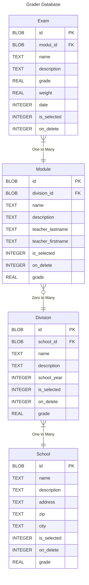

# Grader - A Grade Tracker

This Application is designed to Easily Track Your Grades in School and Calculate the Average And Overall Grades of given Grades.

## Features

This Features are _Still in Progress_. **Not FINAL**

- [X] Save Grades for each subject
- [X] Get the average of the given subject Grade
- [ ] Export the Data in either a JSON or CSV Format (JSON is complete)
- [ ] rounding to full or .5 grade
- [ ] easily manage grades

## Database Schema (***NOT UP TO DATE***)

in SQLlite hat es kein uuid type, muss als string oder blob speichern
